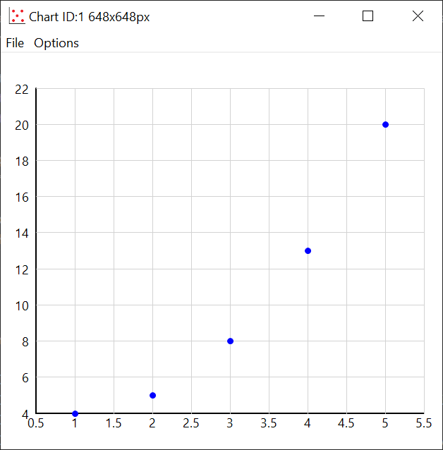
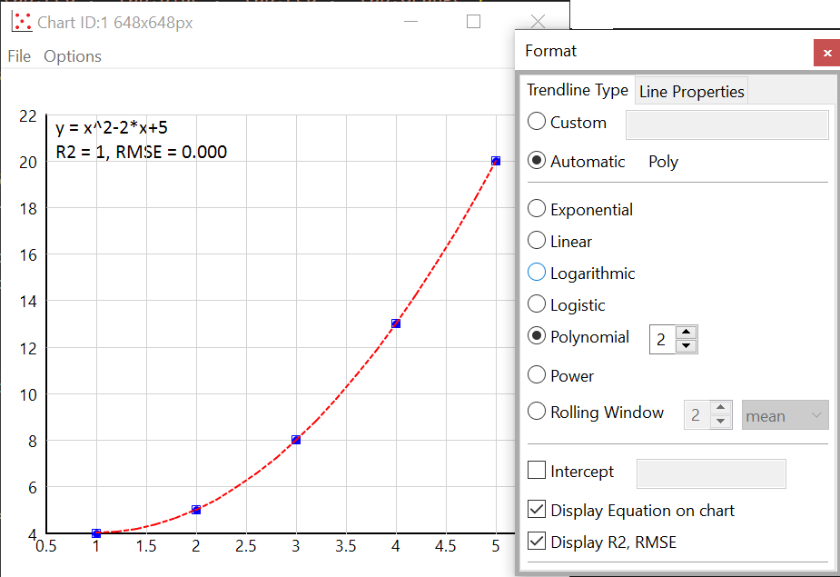

## scisuit

A computing and plotting library designed with engineers
in mind..

## Platform

Windows and Python 3.10, 3.11 and 3.12.


&nbsp;


## Available Libraries

1. Plotting,
2. Engineering
3. Statistical Distributions and Tests,
4. Numerics: Roots, Integration, Fitting


&nbsp;


## Plot Library

Completely interactive charts (Bar, Box-Whisker, Bubble, Histogram, Line, Pie, Psychrometry, 
QQnorm, QQplot, Quiver, Scatter).

Let's demonstrate with a simple example:

### scatter

```python
import numpy as np
import scisuit.plot as plt 

x = np.arange(1, 6)
y = x**2 - 2*x + 5

plt.scatter(x=x, y=y)
plt.show()
```



Once the chart is displayed, let's say a trendline is wished to be added:

1. Click on one of the data points to select the series,
2. Right-click and select "Add trendline",
3. By default a linear trendline will be added. 

Just right-click again and select "Format Trendline" and following options will be shown:




&nbsp;


## Engineering Library

```python
from scisuit.eng import psychrometry

result = psychrometry(P=101, Tdb=30, Twb=20)

#all of the properties
print(result)
```
```
P=101.0 kPa,
Tdb=30.0 C
Twb=20.0 C
Tdp=14.17 C
H=57.06 kJ/kg da
RH=39.82 %
W=0.0106 kg/kg da
V=0.876 m3/kg da
```
