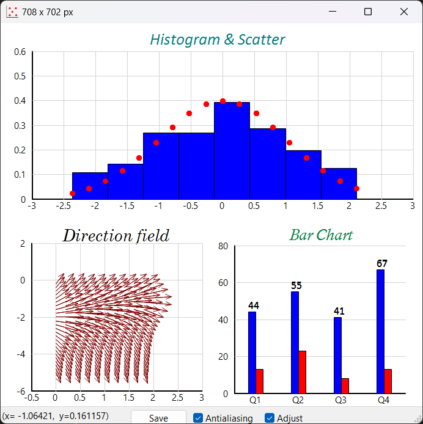
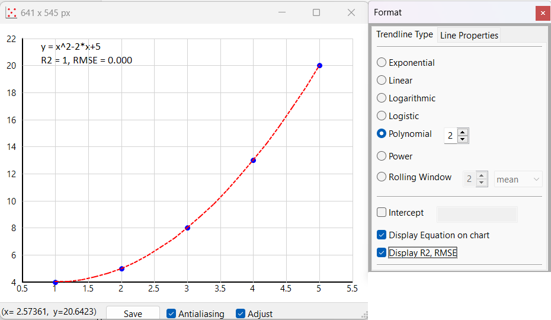

## scisuit

A computing and plotting library designed with engineers
in mind..

## Platform

Windows and Python 3.10, 3.11 and 3.12.


&nbsp;


## Available Libraries

1. Plotting,
2. Engineering
3. Statistical Distributions and Tests,
4. Numerics: Roots, Integration, Fitting


&nbsp;


## Plot Library

Completely interactive charts (Bar, Box-Whisker, Bubble, Histogram, Line, Pie, Psychrometry, 
QQnorm, QQplot, Quiver, Scatter). Using the `plot.gdi` library existing charts can be extended 
or new visualizations can be created.




A simple scatter chart example:


```python
import numpy as np
import scisuit.plot as plt 

x = np.arange(1, 6)
y = x**2 - 2*x + 5

plt.scatter(x=x, y=y)
plt.show()
```

Once the chart is displayed, let's say a trendline is wished to be added:

1. Click on one of the data points to select the series,
2. Right-click and select "Add trendline",
3. By default a linear trendline will be added. 

Just right-click again and select "Format Trendline" and following options will be shown:




&nbsp;
&nbsp;


## Engineering Library

Designed mostly for process engineers.

### Examples

**1. Psychrometry:**

Computation of properties of humid-air.

```python
from scisuit.eng import psychrometry

r = psychrometry(P=101, Tdb=30, Twb=20)

#all of the properties
print(r)
```
```
P=101.0 kPa,
Tdb=30.0 C
Twb=20.0 C
Tdp=14.17 C
H=57.06 kJ/kg da
RH=39.82 %
W=0.0106 kg/kg da
V=0.876 m3/kg da
```


&nbsp;

**2. Food:**

A rich class for not only computation of food properties but also
to perform food arithmetic.

```python
import scisuit.eng as eng

milk = eng.Food(water=88.13, protein=3.15, cho=4.80, lipid=3.25, ash=0.67)
water = eng.Food(water=100)

#removal of 87% water from milk
powder = milk - 0.87*water 
print(powder)
```

```
Type = Food
Weight (unit weight) = 0.13
Temperature (C) = 20.0
water (%) = 8.69
cho (%) = 36.92
protein (%) = 24.23
lipid (%) = 25.0
ash (%) = 5.15
aw = 0.194
```


&nbsp;
&nbsp;


## Statistics Library

Follows R notation especially for statistical distributions.

```python
import scisuit.stats as st

#Normal distribution
st.dnorm(0.1, mean=1, sd=2)
st.pnorm(0.1, mean=1, sd=2)


#Binomial distribution
st.dbinom(x=[7, 8, 9], size=9, prob=0.94))

#Weibull distribution
st.dweibull(x=3, shape=2, scale=4)

#log-normal distribution
st.dlnorm(0.1, meanlog=1, sdlog=2)
st.plnorm(0.1, meanlog=1, sdlog=2)
```


&nbsp;
&nbsp;


## Numerics Library

Procedures for root finding, fitting, integration...

```python
from scisuit.roots import bisect, brentq, Info

def func(x):
    return x**2-5

root, info = bisect(f=func, a=0, b=5)

print("**** Bisection method ****")
print(root," ", info)

root, info = brentq(f=func, a=0, b=5)

print("\n **** Brent's method ****")
print(root," ", info)
```

```
**** Bisection method ****
2.2360706329345703   Info(err=9.5367431640625e-06, iter=19, conv=True, msg='')

 **** Brent's method ****
2.2360684081902256   Info(err=None, iter=8, conv=True, msg='')
```