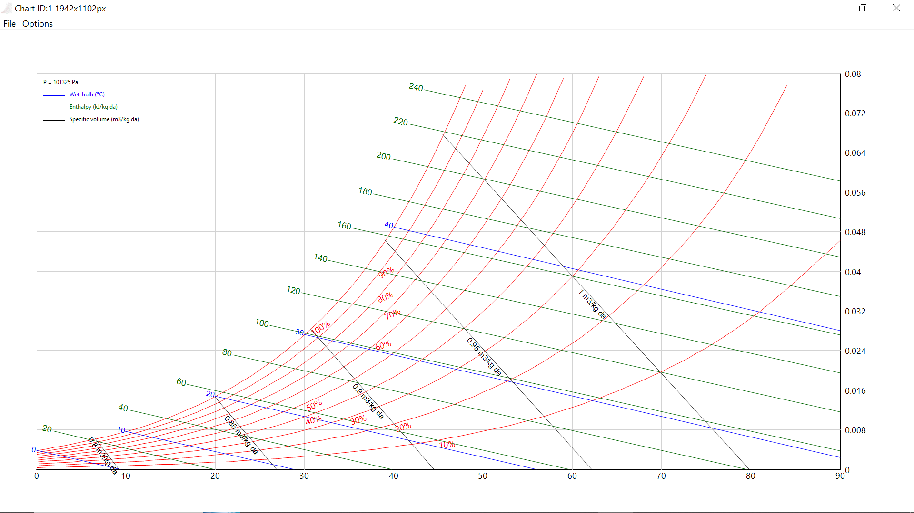

## scisuit

A computing and plotting library designed with engineers
in mind..

## Platform

Windows and Python 3.10, 3.11 and 3.12.


## Libraries

### plot

Completely interactive charts (Bar, Box-Whisker, Bubble, Histogram, Line, Pie, Psychrometry, 
QQnorm, QQplot, Quiver, Scatter).

Let's demonstrate with 2 examples:

### scatter

```python
import numpy as np
import scisuit.plot as plt 

x = np.arange(1, 6)
y = x**2 - 2*x + 5

plt.scatter(x=x, y=y)
plt.show()
```


Once the chart is displayed, let's say a trendline is wished to be added:

1. Click on the series to select,
2. Right-click and select "Add trendline".

By default a linear trendline will be added. Just right-click again and 
select "Format Trendline" and following options will be shown:


### Psychrometry

Heaviy used by engineers in drying, air-conditioning, freezing ...

```python
import scisuit.plot as plt 

plt.psychrometry();
plt.show(maximize=True) #for better visual

```



With just 3 lines of code psychrometric chart can be shown. Psychrometric chart has 
different modes and options as well. Right-click to explore them.


